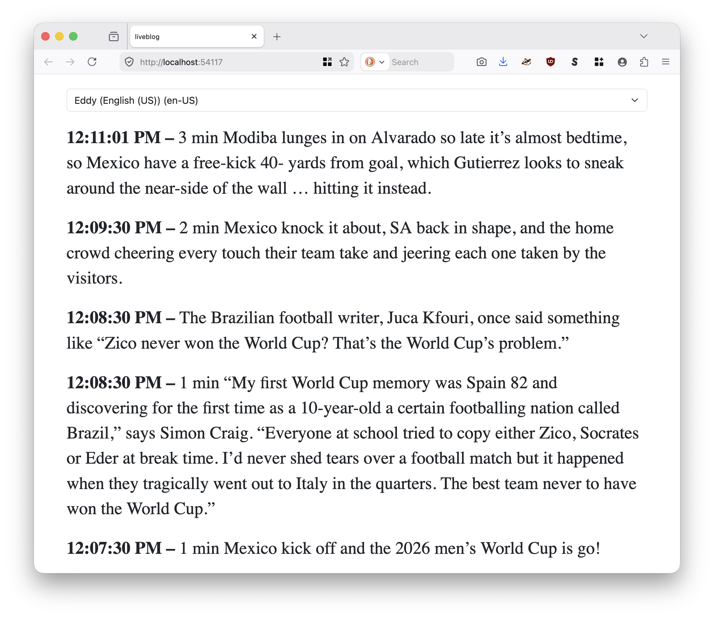

# go-guardian-liveblog

Go package for watching a variety of live blog events and reading them aloud using text-to-speech APIs.

## Concepts

### Parsers

Parsers extract data (posts) for one or more sources. They implement the `Parser` interface:

```
// Parser defines the behavior for extracting data from a source.
// Implementations are responsible for interpreting the content based on 
// the specific logic required by the scheme.
type Parser interface {
	// GetPosts extracts the title and a list of posts from a source identifed by a URI.
	GetPosts(context.Context, string) (string, []string, error)
}
```

### Dispatchers

Dispatchers process (typically speak) a post. They implement the `Dispatcher` interface:

```
// Dispatcher defines the behaviour for sending a message payload.
// Implementations of this interface are responsible for handling the
// actual transmission logic for a specific transport medium.
type Dispatcher interface {
	// Dispatch sends the provided string message to the destination.
	Dispatch(context.Context, string) error
}
```

## Parsers

### Guardian

Extracts posts from live blogging pages on the `theguardian.com`  website.

### La Presse

Extracts posts from live blogging pages on `lapresse.ca` website.

### Le Monde

Extracts posts from live blogging pages on `lemonde.fr` website.

### Random data (debugging)

Generate random post data (for debugging).

## Dispatchers

### Web

Dispatch posts to an Server-Sent Events (SSE) endpoint on a local web server which loads a web application in the default browser on a random port. SSE events are relayed to the web application which then uses the browser's text-to-speech API to narrate the text. The web dispatcher is identified by the following URI:

```
web://
```

Under the hood this is using the PubSub dispatcher (described) below using Go channels; the dispatcher is a PubSub publisher and the web server is a PubSub subscriber. Here's an example of what that looks like:

```
$> go run -mod vendor cmd/follow/main.go \
	-verbose \
	https://www.theguardian.com/football/live/2026/jun/11/mexico-v-south-africa-world-cup-2026-opening-match-live
	
2026/06/11 11:30:30 DEBUG Verbose logging enabled
2026/06/11 11:30:30 DEBUG Start broker subscriber=*subscriber.ChannelSubscriber
2026/06/11 11:30:30 DEBUG Listen for pub sub messages
2026/06/11 11:30:30 DEBUG Handle posts url=https://www.theguardian.com/football/live/2026/jun/11/mexico-v-south-africa-world-cup-2026-opening-match-live read=false
2026/06/11 11:30:30 DEBUG Start server
2026/06/11 11:30:31 DEBUG HEAD request succeeded url=http://localhost:54117
2026/06/11 11:30:31 INFO Server is ready and features are viewable url=http://localhost:54117
2026/06/11 11:30:31 DEBUG Start broker HTTP handler "remote addr"=127.0.0.1:54124 time=2026-06-11T11:30:31.331-07:00
2026/06/11 11:31:00 DEBUG Process URIs
2026/06/11 11:31:00 DEBUG Handle posts url=https://www.theguardian.com/football/live/2026/jun/11/mexico-v-south-africa-world-cup-2026-opening-match-live read=true
2026/06/11 11:31:30 DEBUG Process URIs
2026/06/11 11:31:30 DEBUG Handle posts url=https://www.theguardian.com/football/live/2026/jun/11/mexico-v-south-africa-world-cup-2026-opening-match-live read=true
2026/06/11 11:31:30 DEBUG pubsub dispatch="“I was eight during Italia 90,” recalls Joe Minihane. “Despite having a Mexico 86 red England top, I can’t remember that tournament but was in full campaign mode for the full works in 1990. My dad had let me try it all on in Scott Sports (RIP) in Harlow town centre, but then said we’d have to come another time. A week or so later, he said we’d go and try it on again. We wandered ‘up the town’ and I donned the white top, navy shorts and white socks in the changing room. When I began to take it off, my old man said there was no need, he’d just paid. Core memory right there! My lad is right and is buzzing (but has asked for Curacao away instead).”"
2026/06/11 11:31:30 DEBUG pubsub dispatch="It’s a beauty, is that – consider your job as a father complete, he’s good to go from here."
2026/06/11 11:31:30 DEBUG Broadcast message to clients count=1
2026/06/11 11:31:30 DEBUG Broadcast message to clients count=1

...time passes

2026/06/11 11:35:30 DEBUG Handle posts url=https://www.theguardian.com/football/live/2026/jun/11/mexico-v-south-africa-world-cup-2026-opening-match-live read=true
2026/06/11 11:35:30 DEBUG pubsub dispatch="“Not my first to watch but the only one I ever attended in person – Scotland v Brazil in the 1998 tournament opener in Paris,” says Colin Livingstone. “My chance to see legends of the game in person, Taffarel, Dunga, Ronaldo, Rivaldo, Cafu – just phenomenal. And my all time favourite, Roberto Carlos."
2026/06/11 11:35:30 DEBUG pubsub dispatch="A very fine day in the bars of Paris with all the Brazilian fans, rounded off by bumping into a very merry Ewan McGregor in a nearby seat, who had evidently enjoyed his day too. Happy memories.”"
2026/06/11 11:35:30 DEBUG pubsub dispatch="We got Sky in 96-97, the year Ronaldo was at Barca, and he was maybe the first player that had me saying to my dad “You’ve gotta see this bloke play”, rather than him regaling me with players he’d seen. He’s not the best I’ve seen – though he’s top three – but no one has made my jaw hang open like he did because the speed of him felt and still feels impossible."
```

And in the browser:



### PubSub

Dispatch posts a PubSub-style publisher using the [sfomuseum/go-pubsub](https://github.com/sfomuseum/go-pubsub) package. The PubSub dispatcher is instantiated by URIs defined in the `go-pubsub` package.

Note that _subscribers_ of these PubSub-style messages need to be implemented as needed in your own code.

### Say

Dispatch posts to the MacOS `say` command. The Say dispatcher is identified by the following URI:

```
say://
```

Note that this dispatcher is only available on the MacOS platform.

## Tools

```
$> make cli
go build -mod vendor -ldflags="-s -w" -o bin/follow cmd/follow/main.go
```

### follow

Parse one or more "live blog" URLs and read them aloud.

```
$> ./bin/follow -h
Parse one or more "live blog" URLs and read them aloud.
Usage:
	 ./bin/follow [options] url(N) url(N)
  -delay int
    	The number of seconds to wait before fetching new updates (default 30)
  -dispatcher-uri string
    	A registered aaronland/go-liveblog/dispatcher.Dispatcher URI where posts will be sent. (default "web://")
  -read-all
    	If true read all previous posts (written before following has begun)
  -verbose
    	Enable verbose (debug) logging.
```

The `follow` tool will keep a local cache of posts its already seen (and read) for the duration it is run.

#### Example

##### Random data

```
$> make debug
go run -mod readonly cmd/follow/main.go -verbose http://random.localhost
2026/06/11 09:33:17 DEBUG Verbose logging enabled
2026/06/11 09:33:17 DEBUG Start broker subscriber=*subscriber.ChannelSubscriber
2026/06/11 09:33:17 DEBUG Listen for pub sub messages
2026/06/11 09:33:17 DEBUG Handle posts url=http://random.localhost read=false
2026/06/11 09:33:17 DEBUG Start server
2026/06/11 09:33:18 DEBUG HEAD request succeeded url=http://localhost:56017
2026/06/11 09:33:18 INFO Server is ready and features are viewable url=http://localhost:56017
2026/06/11 09:33:18 DEBUG Start broker HTTP handler "remote addr"=127.0.0.1:56022 time=2026-06-11T09:33:18.314-07:00
2026/06/11 09:33:47 DEBUG Process URIs
2026/06/11 09:33:47 DEBUG Handle posts url=http://random.localhost read=true
2026/06/11 09:33:47 DEBUG pubsub dispatch="In summation, document the company and upgrade the rest. Guard problem with sensible limits."
2026/06/11 09:33:47 DEBUG Broadcast message to clients count=1
^C2026/06/11 09:33:55 INFO Shutdown signal received.
make: *** [debug] Error 1
```

##### The Guardian and Le Monde

```
$> ./bin/follow -dispatcher-uri say:// \
	https://www.lemonde.fr/sport/live/2024/08/07/direct-volley-ball-france-italie-suivez-le-match-des-demi-finales-du-tournoi-masculin-aux-jo-2024_6272013_3242.html \
	https://www.theguardian.com/us-news/live/2024/aug/07/kamala-harris-tim-walz-vp-election-campaign-updates \
	https://www.theguardian.com/sport/live/2024/aug/07/paris-2024-olympics-day-12-live-updates-today-schedule-events-athletics-cycling-golf-diving

2024/08/07 11:10:04 INFO           Le speaker du match n'est-il pas le speaker de Roland Garros ?    Rafa            Vous voulez parler de Marc Maury, aussi connu des spectateurs assidus des meetins d’athlétisme ? C’est possible, mais difficile de vous le confirmer devant notre télévision. Une chose est sûre : sa compétence de chauffeur d’arène n’est plus à prouver.                     

2024/08/07 11:10:23 INFO    Aie aie aie, le service sans sel de Barthélémy Chinenyeze…            Flashé à 7 km/h (ok, on exagère un peu) et directement dans le filet. Muscle ton jeu Barthélémy.                     

2024/08/07 11:10:35 INFO Here is another video of the crowd waiting in anticipation of Kamala Harris and Tim Walz in Eau Claire, Wisconsin, where the duo is set to take the stage at around 2.30pm ET:

2024/08/07 11:10:46 INFO Also in the second race is Letsile Tebogo of Botswana. Real talk, this isn’t the strongest field we’ve ever had, but he might be Lyles’ closest challenger; remember, Lyles hasn’t lost in 26 races, – since the final in Tokyo.
```

##### La Presse

```
$> ./bin/follow \
	-dispatcher-uri say://
	-read-all \
	https://www.lapresse.ca/sports/hockey/2025-02-25/1re-periode/hurricanes-0-canadien-0.php

2025/02/25 17:06:41 INFO Brent Burns atteint Caufield au visage, il est à son tour chassé. Le Canadien jouera à 5 contre 3 pendant 1 min 17 s
2025/02/25 17:06:49 INFO 
2025/02/25 17:06:49 INFO Le Canadien retourne en avantage numérique. Gostisbehere fait trébucher Dvorak, mais c'est Gallagher qui était à l'origine de la séquence
2025/02/25 17:06:58 INFO Assez brouillon pour le Canadien en 2e jusqu'ici
2025/02/25 17:07:02 INFO Un bel arrêt de Montembeault contre Jarvis dès le départ
2025/02/25 17:07:05 INFO C'est reparti pour la 2e période et de retour à 5 contre 5


2025/02/25 17:07:39 INFO Beaucoup de passes, mais pas de tir. Le triangle défensif ne permet aucune passe dangereuse vers Laine
2025/02/25 17:08:10 INFO Gostisbehere de retour. Le Canadien joue maintenant à 5 contre 4 pendant 35 secondes
2025/02/25 17:09:39 INFO De retour à 5 contre 5. Des décisions douteuses de Laine et Newhook ont fait mal au Canadien. Et les Hurricanes ont montré pourquoi ils sont 1ers dans la LNH en désavantage
```

_Note: User comments (and replies) are not supported yet._